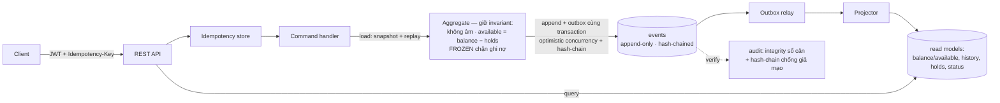
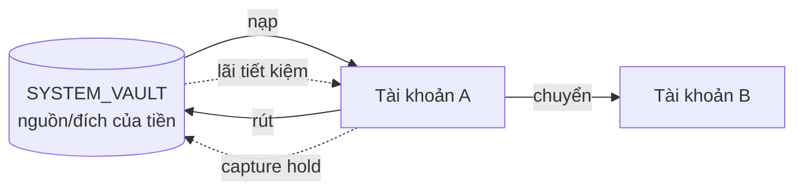

# Ledger — Event-Sourced Banking Core

> Lõi sổ cái tài chính xây theo **Event Sourcing + CQRS**, chuẩn doanh nghiệp.
> Business cố tình đơn giản (nạp/rút/chuyển/tiết kiệm) để dồn chú ý vào *cách* xử lý:
> bất biến dữ liệu, ghi sổ kép, chống race condition, idempotency, audit chống giả mạo,
> tua lại lịch sử, và kiểm soát rủi ro (hold, đóng băng gian lận).

[]()
[]()
[]()
[]()
[]()
[]()
[]()

Mọi thay đổi tiền là một **event bất biến** (không bao giờ UPDATE/DELETE). Số dư được
*suy ra* từ chuỗi event. Toàn hệ thống tuân thủ **ghi sổ kép**: tiền không tự sinh ra hay
mất đi, **tổng số dư luôn là một hằng số kiểm tra được**. Chuỗi event được **hash-chain**
nên mọi sửa đổi lén đều bị phát hiện. Đây không phải "thêm một app ngân hàng" — đây là bài
thể hiện chiều sâu kỹ thuật backend, kèm một frontend có chủ đích.

> Đọc nhanh: [PROJECT_BRIEF.md](./PROJECT_BRIEF.md). Tài liệu đầy đủ: [docs/](./docs/README.md).
> Mọi quyết định lớn được ghi lại thành ADR (15 cái) — xem [chỉ mục bên dưới](#quyết-định-kiến-trúc-adr).

## Vòng đời một lệnh (Command → Event → Read model)



Ghi: tải aggregate (snapshot + replay phần sau) → kiểm invariant → append event **và**
outbox trong cùng một transaction, mỗi event nối vào **hash-chain** của aggregate. Đọc:
phục vụ thẳng từ read model (nhanh như CRUD). Relay đẩy event sang projector; drain ngay
sau commit để có read-your-writes.

## Ghi sổ kép & bảo toàn tiền (thesis của dự án)



Mỗi lần di chuyển tiền sinh **hai posting** (một ghi nợ, một ghi có) cùng `txId` — tiền chỉ
*đổi chỗ*, không sinh/mất. `SYSTEM_VAULT` giải bài "tiền từ đâu ra" (được phép âm). Hệ quả:
`SUM(mọi số dư) == hằng số khai sinh`, chứng minh bất cứ lúc nào tại `GET /audit/integrity`.

## Tính năng nổi bật

| Lĩnh vực | Điều thú vị về mặt kỹ thuật |
|----------|------------------------------|
| **Ghi sổ kép + toàn vẹn** | SYSTEM_VAULT giải bài "tiền từ đâu ra"; `GET /audit/integrity` chứng minh `SUM(mọi số dư) == hằng số`. |
| **Đúng dưới đồng thời** | Optimistic concurrency theo từng aggregate + retry. Có **concurrency test** (nhiều thread rút cùng tài khoản, không bao giờ âm sai) và **property-based test (jqwik)** ném hàng trăm dãy ngẫu nhiên, assert invariant. |
| **Idempotency** | Header `Idempotency-Key` → gửi trùng chỉ tạo một hiệu lực, trả lại response cũ. |
| **Transactional outbox** | Event + outbox ghi cùng transaction → không mất projection; relay là lưới an toàn phục hồi sau crash. |
| **Time & audit** | Snapshot (load ≈ hằng số), **time-travel** số dư theo thời điểm, **reversal** bằng bút toán bù (không xóa lịch sử), metadata `correlationId`/`userId` trên mọi event. |
| **Audit chống giả mạo** | **Hash-chain** SHA-256 theo từng aggregate (mỗi event nối hash event trước + cả metadata). `GET /audit/hash-chain` phát hiện sửa-tại-chỗ và xoá-event-giữa-chuỗi. Threat model trung thực: tamper-*evidence*, không phải tamper-proof (ADR-0014). |
| **Bảo mật** | JWT (access + refresh), băm BCrypt, ownership check (không truy cập chéo tài khoản), vai trò CUSTOMER/ADMIN/AUDITOR. **Rate limiting** token-bucket theo IP (chống dò mật khẩu) → 429; **OWASP Dependency-Check** (SCA) chạy CI theo lịch (ADR-0018). |
| **Hold / reservation** | Tách **số dư khả dụng vs thực** (`available = balance − Σ holds`); đặt giữ → thu (capture, ghi sổ kép) / nhả; scheduler tự nhả khi hết hạn. Ghi nợ tôn trọng `available`. |
| **Phát hiện gian lận** | Luật rule-based sau mỗi ghi nợ (giao dịch lớn bất thường, tần suất cao) → **tự đóng băng**; tài khoản **FROZEN** chặn ghi nợ (vẫn nhận ghi có). Admin freeze/unfreeze. Best-effort, không làm hỏng giao dịch đã commit (ADR-0015). |
| **Hạn mức ngày** | Chặn **cứng** tổng ghi nợ/ngày mỗi tài khoản, kiểm tra **trong transaction** từ event store; **chính xác cả khi đồng thời** nhờ optimistic concurrency serialize ghi nợ theo aggregate (ADR-0016). |
| **Nghiệp vụ nâng cao** | Tài khoản tiết kiệm + **tính lãi qua replay** (bình quân gia quyền thời gian); **lệnh chuyển tiền định kỳ** (at-most-once). |
| **Quan sát được** | Micrometer/Prometheus: độ trễ lệnh, throughput, tỉ lệ xung đột, **projection lag**. Benchmark thật (bên dưới). |
| **Frontend anti-slop** | React + TS, design token tự dựng; signature **"dựng lại số dư từ chuỗi sự kiện"**, time-travel viewer, sao kê dạng sổ cái, hold & trạng thái đóng băng được surface có chủ đích. |
| **Console Quản trị/Kiểm toán** | Màn admin (hiện theo vai trò qua JWT) surface **xác minh hash-chain** (một nút → sổ nguyên vẹn?) và **quản lý đóng băng**. Admin bootstrap seed lúc khởi động (tắt ở prod). Phân quyền thật ở server (ADR-0017). |
| **Đa tiền tệ + FX** (P9) | Mỗi tài khoản một tiền tệ, **mỗi tiền tệ một vault**; quy đổi (FX) = 2 bút toán cùng tiền tệ bắc cầu qua vault ở **tỉ giá cấu hình** → **integrity cân theo TỪNG tiền tệ**. Backward-compat hoàn toàn (ADR-0019). |
| **Maker-checker** | Chuyển tiền **vượt ngưỡng** chờ một **ADMIN khác người tạo** duyệt (nguyên tắc bốn-mắt). Tự duyệt → 403. Khép kín bộ kiểm soát rủi ro cùng hold/fraud/hạn mức (ADR-0020). |

## Benchmark (đo thật, single-client)

| Thao tác | p50 | p99 | Mục tiêu MVP | Mục tiêu Flagship |
|----------|-----|-----|--------------|-------------------|
| Ghi (deposit) | 7.9ms | 14.6ms | < 200ms ✅ | < 100ms ✅ |
| Đọc (balance) | 3.1ms | 4.3ms | < 50ms ✅ | < 20ms ✅ |

Chi tiết + script k6 đo concurrency: [docs/benchmarks/](./docs/benchmarks/README.md).

## Chạy local (< 15 phút)

**Yêu cầu:** JDK 21, Node 20+, PostgreSQL (Docker hoặc cài sẵn). Gradle dùng wrapper sẵn.

```bash
# 1. PostgreSQL (Docker) — hoặc Postgres cài sẵn với DB + role "ledger"/"ledger"
docker compose -f ops/docker-compose.yml up -d

# 2. Backend API (cửa sổ 1) — cần JAVA_HOME trỏ JDK 21
cd backend && ./gradlew bootRun           # Windows: .\gradlew.bat bootRun
# kiểm tra: curl http://localhost:8080/actuator/health  ->  {"status":"UP"}

# 3. Frontend (cửa sổ 2)
cd frontend && npm install && npm run dev  # http://localhost:5173
```

Trong UI: đăng ký → mở tài khoản → nạp/rút/chuyển → xem **replay dựng số dư**, **sao kê**,
**time-travel**, **đặt giữ tiền (hold)**, lệnh **định kỳ**, và trang **Kiểm toán** (sổ luôn
cân). Rút một khoản lớn để thấy **tự đóng băng** chống gian lận. Đăng nhập **`admin`/`admin12345`**
(seed dev) để vào màn **Quản trị**: bấm **xác minh hash-chain** (sổ không bị giả mạo) và **mở băng**
tài khoản. Metrics tại `/actuator/prometheus`.

## Demo nhanh (script đi qua mọi tính năng)

Backend chạy là đủ — một script Node gọi API thật và đi qua **toàn bộ** tính năng theo phase
(đăng ký/JWT, mở tài khoản đa tiền tệ, ghi sổ kép + integrity, chuyển tiền + ownership,
idempotency, hold, FX, time-travel, reversal, hash-chain, fraud auto-freeze, maker-checker,
lãi/lệnh định kỳ, phân quyền, rebuild, metrics, rate-limit):

```bash
node ops/demo-e2e.mjs      # in ra từng bước ✓ với kết quả thật
```

## Giao diện (8 màn)

| Màn | Điểm nhấn |
|-----|-----------|
| **Đăng nhập** | Đăng nhập/đăng ký, dark theme + accent xanh |
| **Bảng điều khiển** | Tổng số dư **theo từng tiền tệ**, badge "Sổ cân", thẻ tài khoản, feed hoạt động |
| **Chi tiết tài khoản** | Signature **"dựng lại số dư từ chuỗi sự kiện"**, biểu đồ + **slider time-travel**, sao kê dạng sổ cái |
| **Chuyển tiền / Quy đổi (FX)** | Chuyển cùng tiền tệ + **quy đổi tỉ giá**; báo "chờ duyệt" khi vượt ngưỡng (maker-checker) |
| **Định kỳ** | Tạo lệnh chuyển định kỳ (scheduler at-most-once) |
| **Kiểm toán** | Toàn vẹn sổ cái — "Sổ cân", chênh lệch 0 |
| **Bảo mật** | Bật/tắt **2FA (TOTP)** — ghi danh QR/secret, xác nhận bằng mã |
| **Quản trị** (ADMIN/AUDITOR) | Xác minh **hash-chain**, **mở băng** tài khoản, **duyệt** giao dịch vượt ngưỡng |

Trạng thái **đóng băng** hiện chip ❄ trên dashboard + banner sắc lạnh trên tài khoản (chỉ cho nạp).
Ảnh chụp màn hình: xem hướng dẫn ở [docs/screenshots/](./docs/screenshots/README.md).

## Kiểm thử

106 test, gồm: **unit** (aggregate, invariant không-âm/available/freeze, tính lãi, rate-limit, validation số tiền, TOTP RFC 6238), **integration**
trên PostgreSQL thật (vòng đời ES/CQRS, rebuild, snapshot, time-travel, reversal, hold, hash-chain HMAC,
fraud/freeze, hạn mức ngày, admin seed, rate limiting, đa tiền tệ + FX per-currency integrity, maker-checker + chống duyệt-đôi, refresh token rotation + thu hồi, 2FA/TOTP, Kafka event backbone qua broker nhúng), **property-based** (jqwik — invariant với dãy ngẫu nhiên), **concurrency** (nhiều
thread, không double-spend), **security** (MockMvc — 401/403/ownership + phân quyền CUSTOMER/ADMIN/AUDITOR trên audit & admin), **idempotency**,
**outbox durability**. CI (GitHub Actions) build + test backend (Postgres service) và build frontend
trên mỗi push.

## Cấu trúc repo

```
Ledger/
├── PROJECT_BRIEF.md     # bối cảnh dự án (đọc trước)
├── docs/                # tài liệu nền + adr/ (15 ADR) + benchmarks/
├── backend/             # Spring Boot API (module: shared, account, audit, iam)
├── frontend/            # React + TypeScript (Vite) — 7 màn hình
└── ops/                 # docker-compose (PostgreSQL), k6 load test
```

Module backend (package-by-feature): `shared` (event store + hash-chain, outbox, idempotency,
snapshot, concurrency, observability, security) · `account` (domain/command/projection/query/api +
interest, standingorder, **hold**, **fraud**) · `audit` (integrity, hash-chain verify) · `iam`
(auth, JWT). Frontend 7 màn: Đăng nhập · Bảng điều khiển · Chi tiết tài khoản · Chuyển tiền ·
Định kỳ · Kiểm toán · Quản trị (ADMIN/AUDITOR).

## Quyết định kiến trúc (ADR)

| # | Quyết định |
|---|------------|
| [0001](./docs/adr/0001-modular-monolith.md) | Modular Monolith thay vì Microservices |
| [0002](./docs/adr/0002-postgres-event-store.md) | PostgreSQL làm event store (JDBC thuần) |
| [0003](./docs/adr/0003-transactional-outbox.md) | Transactional Outbox thay vì message broker |
| [0004](./docs/adr/0004-double-entry-system-vault.md) | Double-entry + SYSTEM_VAULT |
| [0005](./docs/adr/0005-account-centric-postings.md) | Posting account-centric cho double-entry |
| [0006](./docs/adr/0006-transactional-outbox-and-retry.md) | Outbox + retry (read-your-writes qua drain) |
| [0007](./docs/adr/0007-idempotency-keys.md) | Idempotency-Key cho endpoint ghi tiền |
| [0008](./docs/adr/0008-snapshots-time-travel-reversal.md) | Snapshot, time-travel, reversal |
| [0009](./docs/adr/0009-security-and-identity.md) | JWT + ownership + vai trò |
| [0010](./docs/adr/0010-observability-and-performance.md) | Prometheus metrics + benchmark |
| [0011](./docs/adr/0011-frontend-and-design-system.md) | Frontend React/TS + design anti-slop |
| [0012](./docs/adr/0012-advanced-business.md) | Tiết kiệm/lãi qua replay + lệnh định kỳ |
| [0013](./docs/adr/0013-hold-reservation.md) | Hold/reservation: available vs balance |
| [0014](./docs/adr/0014-hash-chain-tamper-evidence.md) | Hash-chain chống giả mạo event store |
| [0015](./docs/adr/0015-fraud-detection-and-freeze.md) | Fraud detection rule-based + đóng băng |
| [0016](./docs/adr/0016-daily-transaction-limit.md) | Hạn mức giao dịch theo ngày |
| [0017](./docs/adr/0017-admin-console-and-bootstrap.md) | Console Quản trị/Kiểm toán + admin bootstrap |
| [0018](./docs/adr/0018-hardening-rate-limit-sca-tracing.md) | Hardening: rate limiting + OWASP SCA (OTel hoãn P9) |
| [0019](./docs/adr/0019-multi-currency-and-fx.md) | Đa tiền tệ + quy đổi tỉ giá (FX), integrity per-currency |
| [0020](./docs/adr/0020-maker-checker.md) | Maker-checker (bốn-mắt) cho giao dịch vượt ngưỡng |

## Tech stack

Java 21 (LTS) · Spring Boot 3.5 · Gradle (Kotlin DSL) · PostgreSQL · Flyway · JDBC (event
store) + JPA (read/identity) · Spring Security + JWT · Micrometer/Prometheus · JUnit 5 +
jqwik · React + TypeScript + Vite. Lý do từng lựa chọn: [docs/09-tech-stack-and-setup.md](./docs/09-tech-stack-and-setup.md).

## Trạng thái & lộ trình

Phase 0 → 8 **hoàn chỉnh** + **bắt đầu Phase 9** (đa tiền tệ + FX). Còn lại (tùy chọn): Phase 9 hạ
tầng (tách DB, Kafka, microservice, saga — cần infra); Phase 10 (polish: GIF demo, trang docs).
Xem [docs/07-roadmap-and-phases.md](./docs/07-roadmap-and-phases.md).

## License

[MIT](./LICENSE)
