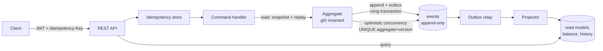

# Ledger — Event-Sourced Banking Core

> Lõi sổ cái tài chính xây theo **Event Sourcing + CQRS**, chuẩn doanh nghiệp.
> Business cố tình đơn giản (nạp/rút/chuyển/tiết kiệm) để dồn chú ý vào *cách* xử lý:
> bất biến dữ liệu, ghi sổ kép, chống race condition, idempotency, audit và tua lại lịch sử.

[]()
[]()
[]()
[]()
[]()
[]()

Mọi thay đổi tiền là một **event bất biến** (không bao giờ UPDATE/DELETE). Số dư được
*suy ra* từ chuỗi event. Toàn hệ thống tuân thủ **ghi sổ kép**: tiền không tự sinh ra hay
mất đi, **tổng số dư luôn là một hằng số kiểm tra được**. Đây không phải "thêm một app
ngân hàng" — đây là bài thể hiện chiều sâu kỹ thuật backend, kèm một frontend có chủ đích.

> Đọc nhanh: [PROJECT_BRIEF.md](./PROJECT_BRIEF.md). Tài liệu đầy đủ: [docs/](./docs/README.md).
> Mọi quyết định lớn được ghi lại thành ADR (12 cái) — xem [chỉ mục bên dưới](#quyết-định-kiến-trúc-adr).

## Vòng đời một lệnh (Command → Event → Read model)



Ghi: tải aggregate (snapshot + replay phần sau) → kiểm invariant → append event **và**
outbox trong cùng một transaction. Đọc: phục vụ thẳng từ read model (nhanh như CRUD).
Relay đẩy event sang projector; drain ngay sau commit để có read-your-writes.

## Tính năng nổi bật

| Lĩnh vực | Điều thú vị về mặt kỹ thuật |
|----------|------------------------------|
| **Ghi sổ kép + toàn vẹn** | SYSTEM_VAULT giải bài "tiền từ đâu ra"; `GET /audit/integrity` chứng minh `SUM(mọi số dư) == hằng số`. |
| **Đúng dưới đồng thời** | Optimistic concurrency theo từng aggregate + retry. Có **concurrency test** (15 thread rút cùng tài khoản, không bao giờ âm sai) và **property-based test (jqwik)** ném hàng trăm dãy ngẫu nhiên, assert invariant. |
| **Idempotency** | Header `Idempotency-Key` → gửi trùng chỉ tạo một hiệu lực, trả lại response cũ. |
| **Transactional outbox** | Event + outbox ghi cùng transaction → không mất projection; relay là lưới an toàn phục hồi sau crash. |
| **Time & audit** | Snapshot (load ≈ hằng số), **time-travel** số dư theo thời điểm, **reversal** bằng bút toán bù (không xóa lịch sử), metadata `correlationId`/`userId` trên mọi event. |
| **Bảo mật** | JWT (access + refresh), băm BCrypt, ownership check (không truy cập chéo tài khoản), vai trò CUSTOMER/ADMIN/AUDITOR. |
| **Nghiệp vụ nâng cao** | Tài khoản tiết kiệm + **tính lãi qua replay** (bình quân gia quyền thời gian); **lệnh chuyển tiền định kỳ** (at-most-once). |
| **Quan sát được** | Micrometer/Prometheus: độ trễ lệnh, throughput, tỉ lệ xung đột, **projection lag**. Benchmark thật (bên dưới). |
| **Frontend anti-slop** | React + TS, design token tự dựng; signature **"dựng lại số dư từ chuỗi sự kiện"**, time-travel viewer, sao kê dạng sổ cái. |

## Benchmark (đo thật, single-client)

| Thao tác | p50 | p99 | Mục tiêu MVP | Mục tiêu Flagship |
|----------|-----|-----|--------------|-------------------|
| Ghi (deposit) | 7.9ms | 14.6ms | < 200ms ✅ | < 100ms ✅ |
| Đọc (balance) | 3.1ms | 4.3ms | < 50ms ✅ | < 20ms ✅ |

Chi tiết + script k6 đo concurrency: [docs/benchmarks/](./docs/benchmarks/README.md).

## Chạy local (< 15 phút)

**Yêu cầu:** JDK 21, Node 20+, PostgreSQL (Docker hoặc cài sẵn). Gradle dùng wrapper sẵn.

```bash
# 1. PostgreSQL (Docker) — hoặc Postgres cài sẵn với DB + role "ledger"/"ledger"
docker compose -f ops/docker-compose.yml up -d

# 2. Backend API (cửa sổ 1) — cần JAVA_HOME trỏ JDK 21
cd backend && ./gradlew bootRun           # Windows: .\gradlew.bat bootRun
# kiểm tra: curl http://localhost:8080/actuator/health  ->  {"status":"UP"}

# 3. Frontend (cửa sổ 2)
cd frontend && npm install && npm run dev  # http://localhost:5173
```

Trong UI: đăng ký → mở tài khoản → nạp/rút/chuyển → xem **replay dựng số dư**, **sao kê**,
**time-travel**, và trang **Kiểm toán** (sổ luôn cân). Metrics tại `/actuator/prometheus`.

## Kiểm thử

47 test, gồm: **unit** (aggregate, invariant không-âm, tính lãi), **integration** trên
PostgreSQL thật (vòng đời ES/CQRS, rebuild, snapshot, time-travel, reversal), **property-based**
(jqwik — invariant với dãy ngẫu nhiên), **concurrency** (nhiều thread, không double-spend),
**security** (MockMvc — 401/403/ownership/vai trò), **idempotency**, **outbox durability**.
CI (GitHub Actions) build + test backend (Postgres service) và build frontend trên mỗi push.

## Cấu trúc repo

```
Ledger/
├── PROJECT_BRIEF.md     # bối cảnh dự án (đọc trước)
├── docs/                # 12 tài liệu nền + adr/ (12 ADR) + benchmarks/
├── backend/             # Spring Boot API (module: shared, account, audit, iam)
├── frontend/            # React + TypeScript (Vite) — 5 màn hình
└── ops/                 # docker-compose (PostgreSQL), k6 load test
```

Module backend (package-by-feature): `shared` (event store, outbox, idempotency, snapshot,
concurrency, observability, security) · `account` (domain/command/projection/query/api +
interest, standingorder) · `audit` (integrity) · `iam` (auth, JWT).

## Quyết định kiến trúc (ADR)

| # | Quyết định |
|---|------------|
| [0001](./docs/adr/0001-modular-monolith.md) | Modular Monolith thay vì Microservices |
| [0002](./docs/adr/0002-postgres-event-store.md) | PostgreSQL làm event store (JDBC thuần) |
| [0003](./docs/adr/0003-transactional-outbox.md) | Transactional Outbox thay vì message broker |
| [0004](./docs/adr/0004-double-entry-system-vault.md) | Double-entry + SYSTEM_VAULT |
| [0005](./docs/adr/0005-account-centric-postings.md) | Posting account-centric cho double-entry |
| [0006](./docs/adr/0006-transactional-outbox-and-retry.md) | Outbox + retry (read-your-writes qua drain) |
| [0007](./docs/adr/0007-idempotency-keys.md) | Idempotency-Key cho endpoint ghi tiền |
| [0008](./docs/adr/0008-snapshots-time-travel-reversal.md) | Snapshot, time-travel, reversal |
| [0009](./docs/adr/0009-security-and-identity.md) | JWT + ownership + vai trò |
| [0010](./docs/adr/0010-observability-and-performance.md) | Prometheus metrics + benchmark |
| [0011](./docs/adr/0011-frontend-and-design-system.md) | Frontend React/TS + design anti-slop |
| [0012](./docs/adr/0012-advanced-business.md) | Tiết kiệm/lãi qua replay + lệnh định kỳ |

## Tech stack

Java 21 (LTS) · Spring Boot 3.5 · Gradle (Kotlin DSL) · PostgreSQL · Flyway · JDBC (event
store) + JPA (read/identity) · Spring Security + JWT · Micrometer/Prometheus · JUnit 5 +
jqwik · React + TypeScript + Vite. Lý do từng lựa chọn: [docs/09-tech-stack-and-setup.md](./docs/09-tech-stack-and-setup.md).

## Trạng thái & lộ trình

Phase 0 → 8 (một phần) đã xong. Còn lại (tùy chọn): hoàn tất Phase 8 (hold/reservation,
fraud), Phase 9 (distributed: tách DB, Kafka, microservice), Phase 10 (polish). Xem
[docs/07-roadmap-and-phases.md](./docs/07-roadmap-and-phases.md).

## License

[MIT](./LICENSE)
