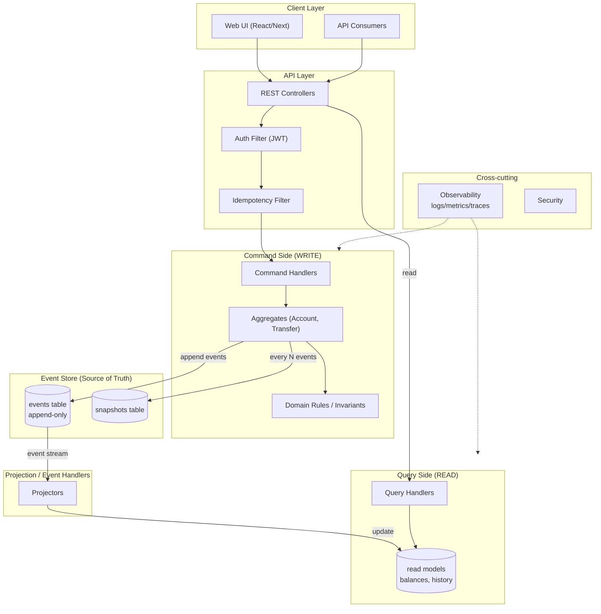
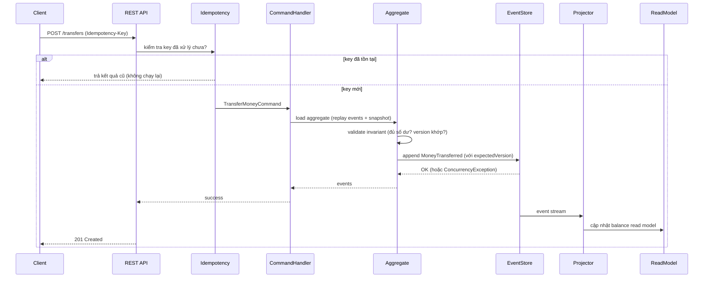

# 01 — Kiến trúc

## 1. Quyết định nền tảng: Modular Monolith → Microservices

### Đề xuất
Bắt đầu bằng **Modular Monolith**, thiết kế với ranh giới module rõ để **sẵn sàng tách** thành microservices ở Phase mở rộng.

### Lý do (trade-off)
| Tiêu chí | Microservices ngay từ đầu | Modular Monolith trước |
|----------|---------------------------|------------------------|
| Độ phức tạp DevOps | Rất cao (service discovery, network, deploy nhiều service) | Thấp (1 artifact) |
| Phù hợp 1 người làm | Kém — dễ chết chìm trong hạ tầng | Tốt |
| Tốc độ ra tính năng | Chậm | Nhanh |
| Thể hiện tư duy hệ thống | Có, nhưng dễ làm hời hợt | Có, qua ranh giới module sạch |
| Đường nâng cấp | — | Tách module → service khi cần |

> **Bẫy phổ biến:** Người mới thường nhảy thẳng vào microservices để trông "hoành tráng", rồi sa lầy vào Docker/Kubernetes/networking thay vì thể hiện chiều sâu domain. Một modular monolith *sạch* khó và ấn tượng hơn một microservices *lộn xộn*. Việc thiết kế "sẵn sàng tách" tự nó đã là tín hiệu trưởng thành.

Quyết định này được ghi thành ADR-0001 (xem mục 7).

## 2. Sơ đồ kiến trúc tổng thể (Phase Flagship)



## 3. Luồng xử lý cốt lõi

### 3.1 Luồng ghi (Command → Event)


### 3.2 Luồng đọc (Query)
Client gọi `GET /accounts/{id}/balance` → Query Handler đọc thẳng từ **read model** (bảng `account_balances` đã dựng sẵn). Không replay. Nhanh như CRUD.

### 3.3 Luồng đặc biệt: Rebuild & Time-travel
- **Rebuild read model:** xóa read model, replay toàn bộ event store → dựng lại. Dùng khi đổi schema read model hoặc sửa bug projection.
- **Time-travel:** replay event của một aggregate đến `timestamp` hoặc `version` cho trước → trạng thái tại thời điểm đó.

## 4. Cấu trúc module (package by feature, không phải by layer)

```
com.ledger
├── shared/                  # kernel dùng chung
│   ├── eventstore/          # abstraction event store, snapshot
│   ├── domain/              # base Aggregate, DomainEvent, Command
│   ├── idempotency/
│   └── observability/
│
├── account/                 # MODULE: vòng đời tài khoản
│   ├── domain/              # AccountAggregate, events, invariants
│   ├── command/             # OpenAccount, command handlers
│   ├── query/               # đọc thông tin account
│   ├── projection/          # account read models
│   └── api/                 # REST controllers
│
├── ledger/                  # MODULE: ghi sổ kép & chuyển tiền
│   ├── domain/              # double-entry, posting, TransferSaga (nội bộ)
│   ├── command/
│   ├── query/               # số dư, lịch sử
│   ├── projection/
│   └── api/
│
├── audit/                   # MODULE: truy vết, time-travel, integrity check
│   ├── query/
│   └── api/
│
└── iam/                     # MODULE: identity & access (auth, user)
    ├── domain/
    ├── command/
    └── api/
```

> **Nguyên tắc ranh giới:** Module chỉ giao tiếp qua *public interface* hoặc *domain event*, không gọi thẳng vào internal của nhau. Đây là điều kiện để sau này tách thành service.

## 5. Các thành phần cốt lõi (khái niệm)

| Thành phần | Vai trò |
|------------|---------|
| **Command** | Ý định thay đổi (OpenAccount, Deposit, Transfer). Có thể bị từ chối. |
| **Aggregate** | Đơn vị nhất quán, giữ invariant (vd: số dư không âm). Sinh event. |
| **Domain Event** | Sự thật đã xảy ra, bất biến (AccountOpened, MoneyTransferred). |
| **Event Store** | Kho event append-only — nguồn sự thật duy nhất. |
| **Snapshot** | Ảnh chụp trạng thái mỗi N event để tăng tốc load. |
| **Projector** | Lắng nghe event, cập nhật read model. |
| **Read Model** | Bảng tối ưu cho đọc (balances, transaction history). |
| **Query Handler** | Phục vụ truy vấn từ read model. |
| **Idempotency Store** | Đảm bảo cùng một command chỉ chạy một lần. |

## 6. Quyết định công nghệ then chốt (chi tiết ở file 09)

- **Event Store:** PostgreSQL (bảng append-only) thay vì EventStoreDB chuyên dụng — đơn giản hóa hạ tầng, vẫn đúng nguyên lý. Có thể nâng cấp sau.
- **Read Model:** PostgreSQL (cùng DB, schema riêng) ở MVP; tách DB khi scale.
- **Event Bus:** ở monolith dùng transactional outbox + in-process dispatch; lên distributed mới đưa Kafka vào.
- **Tại sao không Kafka ngay:** tránh phức tạp khi chưa cần; outbox pattern đảm bảo không mất event mà không cần broker.

## 7. ADR — Architecture Decision Record

Mọi quyết định lớn ghi vào `docs/adr/NNNN-tieu-de.md` theo template:

```markdown
# ADR-NNNN: <Tiêu đề quyết định>

## Trạng thái
Proposed | Accepted | Superseded by ADR-XXXX

## Bối cảnh
Vấn đề gì cần quyết? Ràng buộc nào?

## Quyết định
Ta chọn gì.

## Hệ quả
Được gì, mất gì, đánh đổi ra sao.

## Phương án đã cân nhắc
- Phương án A — vì sao loại
- Phương án B — vì sao loại
```

### ADR khởi đầu cần viết
- **ADR-0001:** Modular Monolith thay vì Microservices (đã nêu mục 1).
- **ADR-0002:** PostgreSQL làm event store thay vì EventStoreDB.
- **ADR-0003:** Outbox pattern thay vì message broker ở giai đoạn đầu.
- **ADR-0004:** Double-entry với SYSTEM_VAULT để mô hình nguồn tiền.

## 8. Bước kế tiếp
Đọc `02-domain-and-business.md` để hiểu mô hình nghiệp vụ và vì sao double-entry là xương sống.
