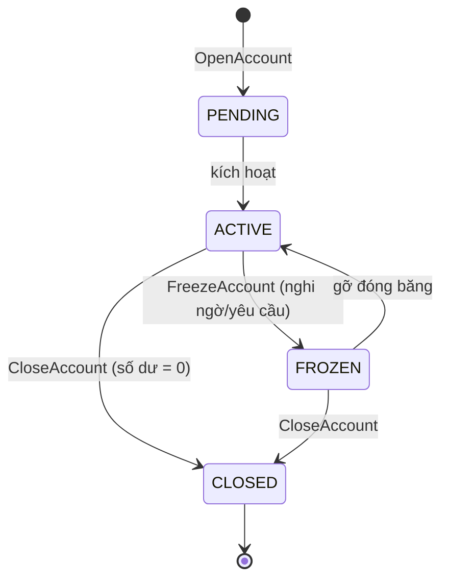

# 02 — Domain & Business

## 1. Nguyên tắc xương sống: Double-Entry Bookkeeping (ghi sổ kép)

Mọi hệ thống tài chính nghiêm túc trong 500 năm qua đều dựa trên ghi sổ kép. Ledger cũng vậy.

### Quy tắc vàng
> **Mọi giao dịch luôn có hai vế: một bên ghi nợ (debit), một bên ghi có (credit), và tổng hai vế luôn bằng nhau.** Tiền không tự sinh ra, không tự mất đi — nó chỉ *di chuyển* giữa các tài khoản.

### Hệ quả: bài toán "tiền từ đâu ra" được giải triệt để
- Tồn tại một tài khoản hệ thống **`SYSTEM_VAULT`** (két ngân hàng), khởi tạo số dư lớn.
- **Nạp tiền** = chuyển từ `SYSTEM_VAULT` → tài khoản khách.
- **Rút tiền** = chuyển từ tài khoản khách → `SYSTEM_VAULT`.
- **Chuyển tiền** = từ tài khoản khách A → tài khoản khách B.

→ Tổng số dư toàn hệ thống **luôn là hằng số**. Đây là một *invariant toàn cục* có thể kiểm tra tự động (xem `04` mục Integrity Check).

### Tính năng "wao" rút ra
Một endpoint `/audit/integrity` chạy: `SUM(tất cả số dư) == tổng khởi tạo?`. Nếu lệch dù 1 đơn vị → có bug nghiêm trọng. Property-based test sẽ ném hàng nghìn giao dịch ngẫu nhiên rồi assert invariant này. Rất ít portfolio có thứ này.

## 2. Ubiquitous Language (ngôn ngữ chung)

| Thuật ngữ | Nghĩa trong Ledger |
|-----------|---------------------|
| **Account** | Tài khoản giữ số dư. Có loại: CUSTOMER, SYSTEM_VAULT, SAVINGS. |
| **Posting** | Một bút toán đơn (một vế debit hoặc credit) lên một account. |
| **Transaction** | Tập các posting cân nhau (tổng debit = tổng credit). |
| **Balance** | Số dư, *suy ra* từ chuỗi event, không lưu như nguồn sự thật. |
| **Ledger Entry / Event** | Sự kiện bất biến đã xảy ra. |
| **Reversal** | Giao dịch bù để hủy hiệu lực một giao dịch trước (không xóa). |
| **Hold / Reservation** | Giữ tạm một khoản (vd: đang chờ xác nhận), chưa trừ hẳn. |

## 3. Aggregates

### 3.1 AccountAggregate
- **Định danh:** `accountId`
- **Trạng thái:** owner, type, status (PENDING/ACTIVE/FROZEN/CLOSED), balance (suy ra), version.
- **Invariant:**
  - Số dư tài khoản CUSTOMER không được âm.
  - Tài khoản FROZEN/CLOSED không nhận lệnh ghi nợ.
  - `SYSTEM_VAULT` được phép âm (đại diện tiền đã phát hành ra lưu thông).
- **Commands:** OpenAccount, FreezeAccount, CloseAccount.
- **Events:** AccountOpened, AccountFrozen, AccountClosed.

### 3.2 TransferAggregate (hoặc Transaction)
Đại diện một lần chuyển tiền giữa hai account, đảm bảo tính nguyên tử của hai vế.
- **Commands:** Deposit, Withdraw, Transfer, ReverseTransaction.
- **Events:** MoneyDeposited, MoneyWithdrawn, MoneyTransferred, TransactionReversed.
- **Invariant:** tổng debit = tổng credit trong cùng một transaction.

## 4. Catalog Events (bản nháp v1)

| Event | Payload chính | Sinh bởi |
|-------|---------------|----------|
| AccountOpened | accountId, owner, type, openedAt | OpenAccount |
| MoneyDeposited | accountId, amount, source=SYSTEM_VAULT, txId | Deposit |
| MoneyWithdrawn | accountId, amount, sink=SYSTEM_VAULT, txId | Withdraw |
| MoneyTransferred | fromId, toId, amount, txId | Transfer |
| TransactionReversed | originalTxId, reason, txId | ReverseTransaction |
| AccountFrozen | accountId, reason | FreezeAccount |
| InterestAccrued | accountId, amount, period | (sản phẩm tiết kiệm) |

> **Quy ước:** Event đặt tên ở **thì quá khứ** (đã xảy ra). Command ở **thể mệnh lệnh** (yêu cầu). Một command có thể bị từ chối; một event thì không thể "rút lại", chỉ có thể bù bằng event khác.

> **Cập nhật (ADR-0005):** Từ Phase 2, đơn vị event của việc di chuyển tiền là **`MoneyPosted`** (một posting account-centric có `direction` CREDIT/DEBIT + `movementType` DEPOSIT/WITHDRAWAL/TRANSFER/GENESIS), thay cho các event riêng `MoneyDeposited/Withdrawn/Transferred` trong bảng trên. Mỗi giao dịch sinh hai `MoneyPosted` cùng `txId`. Lý do: cần consistency boundary + optimistic concurrency theo từng tài khoản. Xem `adr/0005-account-centric-postings.md`.

## 5. Business Rules (quy tắc nghiệp vụ)

1. **Không âm:** tài khoản CUSTOMER không được rút/chuyển quá số dư khả dụng.
2. **Khả dụng vs thực tế:** số dư khả dụng = số dư thực − các khoản đang hold.
3. **Cân vế:** mọi transaction phải cân (double-entry). Hệ thống từ chối transaction lệch vế.
4. **Trạng thái tài khoản:** chỉ ACTIVE mới giao dịch được. FROZEN chỉ nhận credit (nếu chính sách cho phép), không cho debit.
5. **Reversal không xóa:** sửa sai bằng giao dịch bù, giữ nguyên lịch sử.
6. **Idempotency:** cùng một lệnh (cùng Idempotency-Key) chỉ tạo một transaction.
7. **Giới hạn (tùy chọn nâng cao):** hạn mức giao dịch/ngày, ngưỡng cảnh báo gian lận.

## 6. Vòng đời tài khoản

## 7. Sản phẩm tài chính nâng cao (Phase Flagship — làm "dày" business)

Đây là phần biến business từ "đơn giản" thành "có chiều sâu", đồng thời *tận dụng* sức mạnh Event Sourcing:

### 7.1 Tài khoản tiết kiệm + tính lãi
- Lãi được tính bằng cách **replay lịch sử số dư theo thời gian** → minh họa hoàn hảo cho event sourcing & time-travel.
- Mỗi kỳ tính lãi sinh event `InterestAccrued`.

### 7.2 Chuyển tiền định kỳ (standing order)
- Lệnh lặp lại theo lịch (lương, hóa đơn). Một scheduler phát command định kỳ.

### 7.3 Hold/Reservation
- Giữ tạm khoản tiền (vd: thanh toán đang chờ), hết hạn tự nhả. Minh họa concurrency & timeout.

### 7.4 Phát hiện gian lận cơ bản
- Phân tích chuỗi event: nhiều giao dịch lớn bất thường trong thời gian ngắn → sinh cảnh báo. Tận dụng việc *có sẵn toàn bộ lịch sử*.

### 7.5 Đa tiền tệ (Phase distributed)
- Mỗi account gắn một currency; chuyển khác tiền tệ qua tỷ giá, sinh event quy đổi.

## 8. Vì sao mô hình này ấn tượng
- **Double-entry** chứng tỏ hiểu nghiệp vụ tài chính thật, không chỉ code suông.
- **Invariant toàn cục kiểm tra được** là thứ hiếm thấy ở portfolio.
- **Event-driven business** (lãi suất qua replay, fraud qua phân tích lịch sử) cho thấy bạn dùng đúng công cụ cho đúng bài toán.

## 9. Bước kế tiếp
Đọc `03-data-and-eventstore.md` để xem thiết kế lưu trữ event, snapshot và projection.
