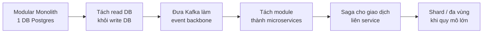

# 05 — Performance & Scaling

## 1. Hai lo ngại kinh điển về Event Sourcing & cách giải

### Lo ngại A — "Đọc số dư chậm dần vì phải replay lịch sử dài"
**Giải:** Hai lớp.
1. **Read model dựng sẵn (CQRS):** vận hành hằng ngày, đọc số dư = SELECT một dòng từ `rm_account_balance`. Nhanh như CRUD. **Gần như không bao giờ replay để đọc.**
2. **Snapshot:** khi *có* cần replay (rebuild, time-travel), bắt đầu từ snapshot gần nhất, chỉ replay ≤ N event sau đó → tốc độ ≈ hằng số.

### Lo ngại B — "Append-only → dung lượng phình vô hạn"
**Giải:**
- Một event chỉ vài chục → vài trăm byte. Một tỷ event ≈ hàng chục GB → quy mô nhỏ với DB hiện đại.
- **Archiving:** event cũ chuyển sang partition lạnh / object storage nén.
- Read model + snapshot giữ DB nóng luôn gọn.
- Với banking, giữ lịch sử là *yêu cầu*, không phải gánh nặng. Lưu trữ rẻ; lịch sử & audit thì vô giá.

> Tổng kết tư duy: **Event Sourcing đánh đổi dung lượng (rẻ) lấy lịch sử + độ tin cậy (đắt giá).** Đó là cuộc trao đổi cố ý và xứng đáng.

## 2. Bản đồ hiệu năng theo từng thao tác

| Thao tác | Đường đi | Độ phức tạp |
|----------|----------|-------------|
| Đọc số dư | SELECT read model | O(1) |
| Đọc lịch sử | SELECT có index theo account+time | O(log n) + trang |
| Ghi giao dịch | load aggregate (snapshot + ≤N event) → validate → append | ≈ O(N) bounded |
| Rebuild read model | replay toàn bộ event store | O(tổng event) — hiếm khi chạy |
| Time-travel | replay 1 aggregate tới mốc | O(event của aggregate) bounded bởi snapshot |
| Integrity check | tổng hợp read model | O(số account) |

## 3. Snapshot — chi tiết chiến lược
- **Ngưỡng:** mỗi N event/aggregate (mặc định N=100, cấu hình được). Cân bằng giữa tần suất ghi snapshot và độ dài replay.
- **Ghi đè:** chỉ giữ snapshot mới nhất mỗi aggregate (snapshot là tối ưu, không phải lịch sử).
- **Bất biến với đúng đắn:** xóa hết snapshot vẫn phải ra kết quả y hệt (chỉ chậm hơn) → là một test quan trọng.

## 4. Caching
- **Read-through cache (vd Redis ở phase sau)** cho số dư truy vấn nóng. Vô hiệu cache theo `last_event_seq` để tránh đọc cũ.
- Ở MVP có thể chưa cần Redis: read model trong PostgreSQL đã đủ nhanh. Thêm cache *khi đo được nút thắt*, không thêm vì "nghe hay".

## 5. Đồng thời & throughput ghi
- Optimistic concurrency theo *từng aggregate*: hai aggregate khác nhau ghi song song thoải mái; chỉ tuần tự hóa khi đụng cùng một aggregate (đúng yêu cầu nghiệp vụ).
- Aggregate "nóng" (vd SYSTEM_VAULT bị đụng mọi lệnh nạp/rút) là điểm nghẽn tiềm tàng → giải pháp: **tách vault theo shard** hoặc dùng kỹ thuật *conflict-free* cho riêng vault ở phase scale.

## 6. Mục tiêu hiệu năng (benchmark đặt ra để đo, không phải khoe suông)
| Chỉ số | Mục tiêu MVP | Mục tiêu Flagship |
|--------|--------------|-------------------|
| Đọc số dư (p99) | < 50ms | < 20ms |
| Ghi giao dịch (p99) | < 200ms | < 100ms |
| Rebuild 1 triệu event | đo & ghi lại | tối ưu theo kết quả |
| Throughput ghi | đo baseline | scale theo nhu cầu |

> Quan trọng: **đo thật** bằng load test (k6/Gatling/JMeter) và ghi số liệu vào docs. Một biểu đồ p99 thật ấn tượng hơn mọi lời tuyên bố.

## 7. Lộ trình mở rộng (khi/nếu cần)

Mỗi bước chỉ thực hiện khi **có lý do đo được** (nghẽn cụ thể), không phải vì "trông pro hơn". Việc *biết khi nào chưa cần* cũng là tín hiệu trưởng thành kỹ thuật.

## 8. Observability (điều kiện để nói về performance một cách nghiêm túc)
- **Metrics:** Micrometer + Prometheus (latency, throughput, conflict rate, projection lag).
- **Tracing:** OpenTelemetry — lần theo một command qua các lớp.
- **Logs có cấu trúc:** JSON, kèm correlationId.
- **Dashboard:** Grafana (có thể chạy local/free).
- **Projection lag** là chỉ số sống còn trong CQRS: read model trễ bao nhiêu so với event store.

## 9. Bước kế tiếp
Đọc `06-uxui-and-anti-slop.md`.
