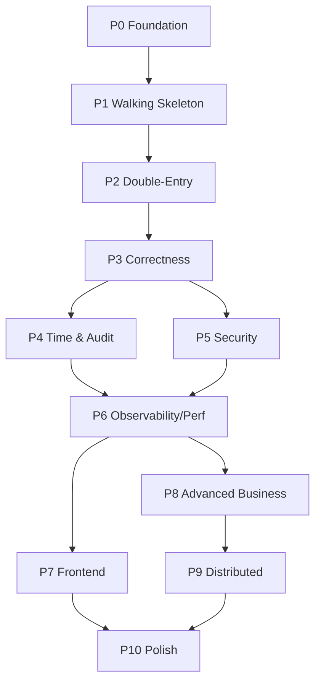

# 07 — Roadmap & Phases

> Dự án flagship, không giới hạn thời gian. Lộ trình chia phase tăng dần độ khó. **Mỗi phase phải "xong sạch" (có test, có docs, deploy được) trước khi sang phase sau** — tránh bẫy phình phạm vi và bỏ dở.

## Nguyên tắc xuyên suốt
- **Vertical slice:** mỗi phase giao một lát cắt *chạy được end-to-end*, không phải nửa vời nhiều tầng.
- **Hiểu trước khi tiến:** kết thúc mỗi phase có bước "self-review & explain" — bạn phải giải thích được mọi quyết định.
- **Definition of Done (DoD) chung:** code + unit/integration test pass + docs cập nhật + chạy được local bằng một lệnh + (từ Phase 2) CI xanh.

---

## Phase 0 — Foundation & Documentation ✅ (đang ở đây)
**Mục tiêu:** Nền tảng tư duy & tài liệu.
- [x] Định vị, vision, phân tích
- [x] Bộ tài liệu kiến trúc/domain/security/performance/uxui
- [ ] Khởi tạo repo, README gốc, license, .gitignore
- [ ] Viết ADR-0001..0004
- [ ] Dựng skeleton project Spring Boot chạy được "hello"
**DoD:** Repo public, docs đầy đủ, `./gradlew bootRun` lên được.

## Phase 1 — Walking Skeleton (Event Sourcing tối thiểu)
**Mục tiêu:** Chứng minh vòng đời ES/CQRS chạy end-to-end với *một* use case.
- [ ] Base: DomainEvent, Aggregate, Command, EventStore (Postgres, append-only)
- [ ] AccountAggregate + AccountOpened
- [ ] Append event + load aggregate bằng replay
- [ ] Projector → read model `rm_account_balance`
- [ ] REST: mở tài khoản, xem số dư
- [ ] Test: mở tài khoản → đọc số dư = 0
**Tính năng wao đầu tiên:** rebuild read model từ event store.
**DoD:** mở tài khoản qua API, số dư phản chiếu đúng từ event, có integration test.

## Phase 2 — Core Ledger + Double-Entry
**Mục tiêu:** Tiền di chuyển đúng, sổ luôn cân.
- [ ] SYSTEM_VAULT + double-entry posting
- [ ] Deposit, Withdraw, Transfer (cân vế)
- [ ] Invariant: số dư CUSTOMER không âm
- [ ] Read model lịch sử giao dịch
- [ ] Integrity check endpoint
- [ ] CI/CD cơ bản (build + test) trên GitHub Actions
**DoD:** chuyển/nạp/rút hoạt động, integrity check pass, CI xanh.

## Phase 3 — Correctness under Pressure (phần lõi giá trị)
**Mục tiêu:** Đúng đắn dưới đồng thời & lỗi.
- [ ] Optimistic concurrency (UNIQUE version) + retry
- [ ] Idempotency key (filter + store)
- [ ] Transactional outbox
- [ ] Property-based test: hàng nghìn giao dịch ngẫu nhiên, assert invariant
- [ ] Concurrency test: nhiều thread rút cùng tài khoản, không âm sai
**DoD:** test concurrency & property pass ổn định, không tạo tiền sai.

## Phase 4 — Time & Audit (tính năng "wao")
**Mục tiêu:** Khai thác sức mạnh độc nhất của ES.
- [ ] Snapshot (mỗi N event) + load qua snapshot
- [ ] Time-travel query (số dư tại thời điểm/version)
- [ ] Reversal (giao dịch bù, không xóa)
- [ ] Audit trail đầy đủ (metadata, correlationId)
- [ ] (Tùy chọn) hash chain chống tampering
**DoD:** trả lời được "số dư ngày X", reversal hoạt động, snapshot tăng tốc đo được.

## Phase 5 — Security & Identity
**Mục tiêu:** Chuẩn bảo mật doanh nghiệp.
- [ ] Auth JWT + refresh, mật khẩu Argon2/BCrypt
- [ ] AuthZ + ownership check + vai trò (CUSTOMER/ADMIN/AUDITOR)
- [ ] Rate limiting, security headers, CORS
- [ ] (Nâng cao) maker-checker cho giao dịch lớn
- [ ] Dependency scan trong CI
**DoD:** không truy cập chéo tài khoản, security checklist pass.

## Phase 6 — Observability & Performance
**Mục tiêu:** Nói về hiệu năng bằng số liệu thật.
- [ ] Metrics (Micrometer/Prometheus), tracing (OTel), structured logs
- [ ] Dashboard Grafana (projection lag, latency, conflict rate)
- [ ] Load test (k6/Gatling), ghi biểu đồ p99 vào docs
- [ ] Tối ưu theo kết quả đo (index, snapshot N, caching nếu cần)
**DoD:** có dashboard + báo cáo benchmark trong docs.

## Phase 7 — Frontend (UX/UI anti-slop)
**Mục tiêu:** Giao diện có chủ đích, trải nghiệm tin cậy.
- [ ] Design token system + tự phản biện chống slop
- [ ] Màn hình: đăng nhập, dashboard số dư, chuyển tiền, sao kê, time-travel viewer
- [ ] Animation replay dựng số dư (signature element)
- [ ] Accessibility AA, responsive, reduced-motion
**DoD:** demo mượt, không generic, accessibility pass.

## Phase 8 — Advanced Business (làm "dày" nghiệp vụ)
**Mục tiêu:** Chiều sâu nghiệp vụ tài chính.
- [ ] Tài khoản tiết kiệm + tính lãi qua replay
- [ ] Chuyển tiền định kỳ (scheduler)
- [ ] Hold/reservation + hết hạn tự nhả
- [ ] Fraud detection rule-based + FraudAlertRaised
**DoD:** ít nhất 2 sản phẩm nâng cao chạy end-to-end.

## Phase 9 — Distributed Evolution (tùy chọn, trình diễn mở rộng)
**Mục tiêu:** Chứng minh hệ thống sẵn sàng scale.
- [ ] Tách read DB / write DB
- [ ] Đưa Kafka làm event backbone
- [ ] Tách 1–2 module thành microservice
- [ ] Saga cho giao dịch liên service
- [ ] (Nâng cao) đa tiền tệ + quy đổi
**DoD:** một luồng chạy qua nhiều service với Saga, có bù trừ khi lỗi.

## Phase 10 — Polish & Storytelling
**Mục tiêu:** Biến repo thành "tài sản phỏng vấn".
- [ ] README cực tốt: chạy được < 15 phút, sơ đồ, GIF demo
- [ ] Trang docs (vd Docusaurus/GitHub Pages)
- [ ] Bài viết/series kể quá trình & quyết định kiến trúc
- [ ] Video demo ngắn các tính năng wao
**DoD:** người lạ hiểu & chạy được, bạn có câu chuyện để kể trong phỏng vấn.

---

## Bản đồ phụ thuộc giữa các phase

## Điểm dừng an toàn (nếu cần ra mắt sớm)
- **Sau Phase 4:** đã đủ ấn tượng cho phỏng vấn (ES/CQRS + double-entry + concurrency + idempotency + time-travel).
- **Sau Phase 7:** sản phẩm "tròn" có cả frontend.
- **Sau Phase 10:** flagship hoàn chỉnh.

## Bước kế tiếp
Đọc `08-todo-backlog.md` để có checklist thi công chi tiết.
